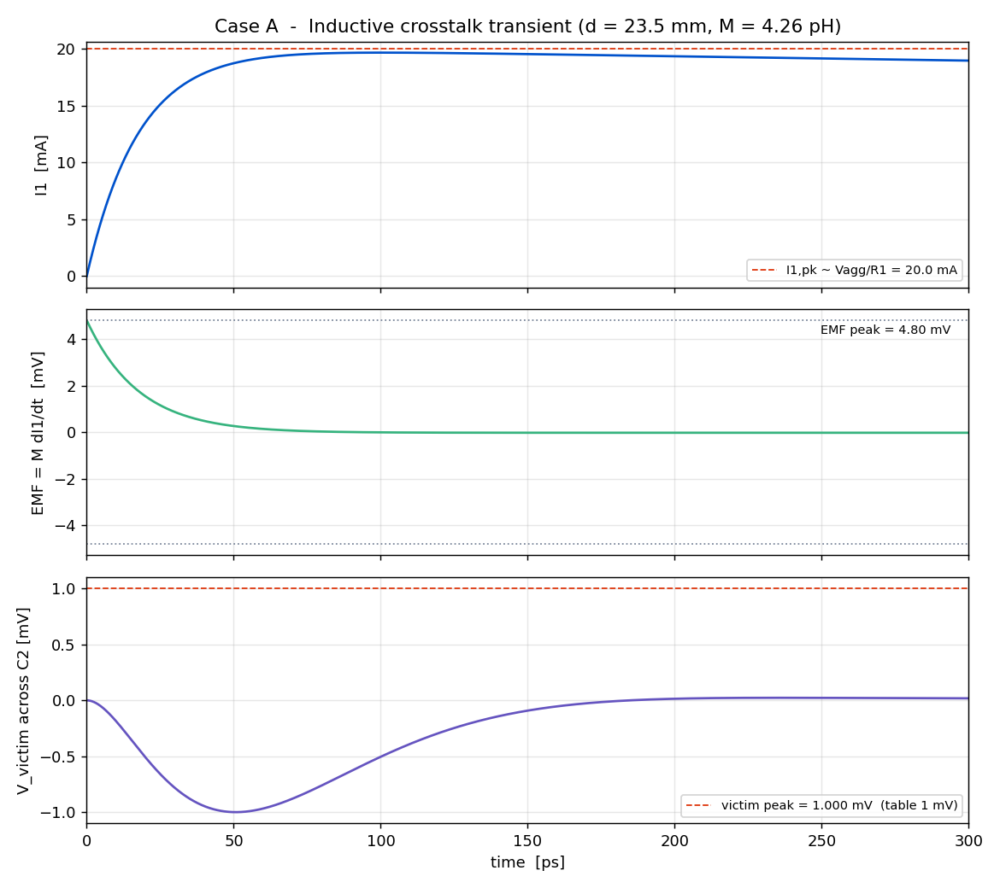

# Inductive Crosstalk (Aggressor → Victim)

Interactive single-file explorer for **board-level inductive crosstalk**: a primary
series-RLC loop (aggressor current I₁) mutually coupled by **M** to a secondary
L₂–R₂–C₂ loop, with the victim measured as the voltage across C₂.

**Live page:** https://borenw.github.io/inductive-crosstalk/ — *Page 30* of
[Bo's Engineering Curriculum](https://borenw.github.io/).

The page derives the coupled 4-state KVL, shows the transient of I₁, the induced
EMF `M·dI₁/dt`, and the filtered victim, and solves the aggressor–victim separation
`d` for a target victim peak (Case A = far / 1 mV, Case B = near / 100 mV, plus a
live Case C that runs the actual RK4 ODE on every keystroke).

## Reproducible Case A model

`inductive_crosstalk_caseA.py` is a one-click, self-contained reproduction of the
**Case A** row of Table 1 (far, target 1 mV victim), integrating the full 4-state
coupled ODE with SciPy and plotting the transient waveforms.

```bash
pip install numpy scipy matplotlib
python3 inductive_crosstalk_caseA.py     # prints sim-vs-table, saves the figure PNG
```

Sim vs. the HTML table (Case A: d = 23.5 mm, M = 4.26 pH, light filter R₂ = 50 Ω, C₂ = 1 pF):

| Quantity | Python sim | Table | diff |
|---|---|---|---|
| Victim peak (across C₂) | 1.000 mV | 1 mV | +0.0% |
| Induced EMF peak (pre-filter) | 4.804 mV | 4.82 mV | −0.3% |
| Primary peak current I₁ | 19.67 mA | 19.7 mA | −0.1% |
| Filter attenuation (EMF/victim) | 4.80× | ~5× | ✓ |


